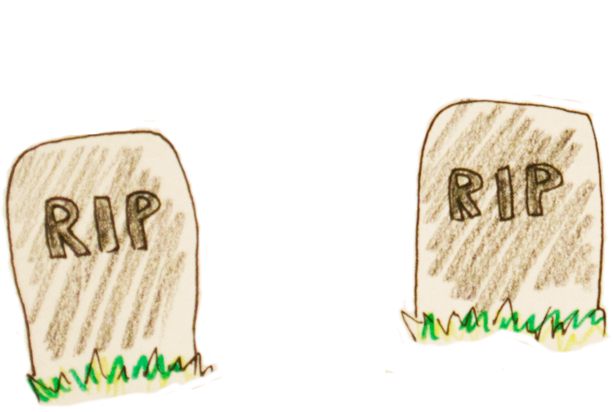

```{r setup, echo = FALSE, message = FALSE, warning = FALSE}
knitr::opts_chunk$set(message = FALSE, warning = FALSE, echo = FALSE, include = TRUE, 
                      fig.align = "center", out.width = "70%")

library(tidyverse)
library(knitr)
library(gridExtra)
library(kableExtra)
library(sp)
```

```{r load_stuff}
source("./functions_n_data.R")
source("./build_plots.R")
```


# Manipulierte Daten?

- Daten können "frisiert" werden, um eine bestimmte Aussage zu vermitteln
- Und/oder: irreführende Darstellung
- Wir wollen aber auf die Fälle eingehen, wo es ohne (bewusste) Manipulation zu Fehlern kommt


# Illusionen

```{r}
# Das gilt für bewusste Manipulation und versehentliche Fehler gleichermaßen:
```

- Wieso können wir überhaupt so gut (von anderen und uns selbst) getäuscht werden?
- Wir sind "pattern seeking primates".
  - Manchmal sehen wir Muster, wo nur Rauschen ist.
  
  
# Visuelle Illusionen

```{r mikado, out.width = '45%'}

```
  
  
# Visuelle Illusionen

</br></br></br>
```{r moehren, out.width = '95%'}

```


# Visuelle Illusionen

```{r kiwi, out.width = '55%'}
# wir kennen das von optischen Illusionen
# kanizsa triangle

```


# "Datenbasierte" Illusionen

```{r nicolas_cage, out.width = "95%"}
# Korrelation "sieht aus wie" Kausalität

knitr::include_graphics("./pics/nicolas_cage.png")
```
<center><font size = "5">@correlation</font></center>

# "Datenbasierte" Illusionen

```{r bedsheets, out.width = "95%"}
# andere Beispiele: 
# Scheidungsrate in Maine + Pro-Kopf-Verzehr von Margarine
# das Alter von Miss America und Morde durch Dampf oder heiße Objekte
# Anzahl der Buchstaben des Siegerwortes in Scripps National Spelling 
# Bee (nationaler Schülerwettbewerb Buchstabieren) und Menschen, die 
# durch giftige Spinnen getötet wurden

knitr::include_graphics("./pics/cheese.png")
```
<center><font size = "5">@correlation</font></center>


# It's not a bug, it's a feature!

- Kosten, etwas zu übersehen üblicherweise höher, als etwas "überzuinterpretieren".

```{r tiger1, out.width = '42%'}

```


# It's not a bug, it's a feature!

- Kosten, etwas zu übersehen üblicherweise höher, als etwas "überzuinterpretieren".

```{r tiger2, out.width = '65%'}
# Wir interpretieren das zur Sicherheit lieber mal als Tiger ...

```


# It's not a bug, it's a feature!

- Kosten, etwas zu übersehen üblicherweise höher, als etwas "überzuinterpretieren".

```{r tiger3, out.width = '60%'}
# Der "schlimmste Fall" einer Überinterpretation

```


# It's not a bug, it's a feature!

- Kosten, etwas zu übersehen üblicherweise höher, als etwas "überzuinterpretieren".

```{r tiger4, out.width = '45%'}
# Der schlimmste Fall, wenn wir etwas übersehen ...
knitr::include_graphics("./pics/tiger4.png")
```

```{r}
# Es ist immer das Tigerbeispiel, auch wenn wir in unserer Umgebung eher 
# selten mit so etwas konfrontiert sind.
# Aber z.B. auch: Schritte hinter einem bei Tag vs. bei Nacht; 
# "Phantomvibrieren" des Handys, wenn man auf eine Nachricht wartet ...

# Und: Kausale Interpretationen sind verdammt nützlich.
```


# Lasst Daten sprechen?

- Problem: Daten sprechen eben nicht "für sich". 
- Wir verstehen sie nicht auf den ersten Blick.


# Lasst Daten sprechen?

</br></br>
```{r circle_table1}
circle1 %>% 
  t() %>% 
  kable() %>% 
  kable_styling(position = "center", bootstrap_options = "striped", font_size = 18)
```

</br></br>

```{r circle_table2}
circle2 %>% 
  t() %>%
  kable() %>% 
  kable_styling(position = "center", bootstrap_options = "striped", font_size = 18)
```
<center><font size = "5">Daten von: @rauser</font></center>


# Besser?

Was ist der Zusammenhang zwischen x und y?
```{r time_series}
# geplottet als time series - noch schlimmer als vorher!
circle_timeseries
```


# Besser!

Was ist der Zusammenhang zwischen x und y?
```{r scatter}
# kreisförmiger scatterplot
circle_scatter
```


# Noch besser

Was ist der Zusammenhang zwischen x und y?
```{r scatter_circle}
# kreisförmiger scatterplot
circle_whole_plot
```

# Fazit

- Wir sind auf Interpretation der Daten (durch andere?) angewiesen.
- Manchmal auch mit bestem Gewissen: fehlerhaft bzw. Selbsttäuschung


# Falsche Fragen stellen

- Daten geben falsche Antworten, wenn man die falschen Fragen stellt.


# Würfel ...
```{r wuerfel_erklaerung1}
# Plot zur Veranschaulichung, wann gezaubert wird
wuerfel_erklaerung
```


# ... verzaubert
```{r}
wuerfel_erklaerung2
```


# Würfel-Magie
```{r wuerfel_plot1}
# mittlere Differenz zum vorherigen Wurf mit vs. ohne Magie
wuerfel_differenz_real +
  labs(title = "mittlerer Unterschied zwischen aufeinanderfolgenden Würfen", 
       y = "Differenz")
```

# frage

</br></br></br></br>
<center><font size="18" color = "#0c2c76">Ist das die richtige Frage?</font></center>


# Der Würfel kann nicht anders

Es wurde eine 1 geworfen:
```{r one_rolled}
one_rolled
```

# Der Würfel kann nicht anders

Es wurde eine 1 geworfen:
```{r one_rolled_diff}
# Wo kann der Würfel nun "hin"?
# Und was wäre dann die Differenz zum vorherigen Wurf?
one_rolled2
```

# Der Würfel kann nicht anders

Es wurde eine 6 geworfen:
```{r six_rolled}
six_rolled
```

# Der Würfel kann nicht anders

Es wurde eine 6 geworfen:
```{r six_rolled_diff}
# Wo kann der Würfel nun "hin"?
# Und was wäre dann die Differenz zum vorherigen Wurf?
six_rolled2
```

# Klappt auch ohne Magie
```{r}
# Plot für Differenz und Verteilung mit vs. ohne Magie nebeneinander
grid.arrange(plot_diff_sim, plot_dist_sim, ncol = 2, widths = c(.4, .6))
```


```{r}
# Notizen Würfel

# Regression zur Mitte täuscht Effekt vor, weil selektiv nur niedrige Nummern "verzaubert"
# kann man für Betrug nutzen (Homöopathie etc.), kann aber auch ohne böse Absicht passieren!

# "Egal wie gut du in Statistik bist, wenn du bei Mensch ärgere dich nicht eine 5 würfelst, denkst du dir: 'Das war knapp!'"
```


# Beispiel Erkältung
```{r}
# sieht so aus, als würde Homöopathie die Erkältung verbessern ...
erkaeltung_hom +
  labs(y = "Symptomstärke")
```


# Beispiel Erkältung
```{r}
# aber der Vergleich mit einem Placebo zeigt, dass es einfach die Zeit ist,
# die es besser macht
# Achtung: ausgedachte Daten, beispielhaft (aber realen Begebenheiten
# nachempfunden)
erkaeltung_both +
  labs(y = "Symptomstärke")
```


# Erwartungen
- Was erwarten wir von unseren Daten?
- Erwartungen beeinflussen, welche Fragen wir stellen.
    - ... und wann wir überhaupt skeptisch werden.


```{r}
# Es folgen Beispiele für FALSE == !TRUE Fragen 
```


# Falsche Frage
```{r}
# falsche Frage: Zusammenhang zwischen x und y über ALLE Daten hinweg?

simpson_konkret_plot
```


# Richtige Frage
```{r}
# richtige Frage: Zusammenhang zwischen x und y in den Subgruppen?
# dazu sagen, dass das ausgedachte Daten sind!
# (semi-)fiktives konkretes Beispiel Simpson's Paradox: mehr 
# Todesfälle in besser ausgestatteten Krankenhäusern
simpson_konkret_groups_plot
```


# Survivership Bias

```{r SurvivorshipBias, out.width = '60%'}
# Wir interpretieren das zur Sicherheit lieber mal als Tiger ...
knitr::include_graphics("./pics/Survivorship-bias.png")
```

<center><font size = "5">Grafik erstellt von <a href = "https://en.wikipedia.org/wiki/Survivorship_bias#/media/File:Survivorship-bias.png">McGeddon</a>, veröffentlicht mit einer <a href = "https://creativecommons.org/licenses/by-sa/4.0/">CC BY-SA 4.0 Lizenz</a></font></center>

# Konsequenzen

- der Fall Sally Clark (1999): vor Gericht, nachdem zwei ihrer Kinder an plötzlichem Kindtstod gestorben waren
    - Die Wahrscheinlichkeit hierfür laut Gutachter Prof. Sir Roy Meadow: 1 zu 73 Millionen.
    - Klare Sache: Das muss Mord gewesen sein!

```{r rip1, out.width = '30%'}

```

<center><font size = "4">@goldacre</font></center>


# Sally Clark

- Fehler 1: Innerhalb einer Familie ist es wahrscheinlicher, dass zwei Kinder am plötzlichen Kindstod sterben


# Sally Clark
  
- Fehler 2 ist kniffliger:
    - Zwei Mal plötzlicher Kindtstod ist extrem unwahrscheinlich ...
    - ... zwei Mal Mord aber auch!
  
```{r rip2, out.width = '50%'}

```


# zufall

</br></br></br></br>
<center><font size="18" color = "#0c2c76">Wir verstehen Zufälle nicht (intuitiv)</font></center>


# Einschätzung von Wahrscheinlichkeiten
```{r probability_weighting}
# Über-/Untergewichtung von sehr niedrigen/hohen Wahrscheinlichkeiten?
# Kahneman & Tversky: probability weighting function
prob_plot +
  labs(x = "tatsächliche Wahrscheinlichkeit", y = "wahrgenommene Wahrscheinlichkeit")
```
<center><font size = "5">Gemäß: @tversky_1992</font></center>


# krebs

<center><font size="7" color = "#0c2c76">@bbc - 'Three-fold variation' in UK bowel cancer death rates</font></center>

```{r krebsatlas3, out.width= '72%'}
colfunc <- colorRampPalette(c("#ff4600", "#0c2c76"))

par(mar = c(.01, 1, .01, 1))

plot(uk, col = sample(colfunc(16), 183, replace = TRUE), 
                   border = "black")
```


# Krebsfälle pro Region

```{r krebs_funnel_plot, out.width = '70%'}
# David Spiegelhalter auf seinem Blog understanding uncertainty


```
<center><font size = "4">@understanding_uncertainty</font></center>
<center><font size = "4">Creative Commons Attribution-Noncommercial-Share Alike 2.0 UK: England & Wales License</font></center>

```{r}
# Erklären:
# funnel plot sieht erst mal wild aus, aber zeigt eigentlich nur:
# die Punkte sind einzelne Städte
# y-Achse: Todesrate durch Krebs, das heißt: je höher eine Stadt in dem Plot liegt,
# desto mehr Leute sterben dort an Krebs - relativ zur Einwohnerzahl!
# spannend ist jetzt die x-Achse: links sind die Städte mit wenig Einwohnern,
# rechts mit vielen Einwohnern

# Komisch: Obwohl hier ja schon die Todesraten PRO 100,000 Einwohnern gezeigt werden,
# also die Einwohnerzahl schon berücksichtigt wurde, scheint die Einwohnerzahl immer
# noch einen Einfluss auf die Todesrate zu haben?
# Erst mal: Es gibt mehr kleine als große Städte
# Es gibt viele kleine Städte mit einer höheren Todesrate als in den großen Städten?
# Aber es gibt genau so viele kleine Städte mit niedrigeren Todesraten als in den
# großen Städten?

# "Kleine Stichproben haben höhere Schwankungen" - erst mal schwer vorstellbar,
# aber gut an einem Beispiel nachzuvollziehen: Wenn ich zwei Mal würfele und es
# kommen "nur Sechsen" (also beide Male), denke ich dann, dass der Würfel gezinkt
# ist? Vergleich: Wenn ich den Würfel 100 Mal werfe und es kommen nur Sechsen,
# denke ich dann, dass der Würfel gezinkt ist?
# Extreme Ergebnisse sind also in kleinen Städten häufiger! Das bedeutet auch:
# Die scheinbar extremen Unterschiede zwischen den Städten sind weniger bedeutungs-
# voll. Das ist so, als würde man einen Würfel immer je zwei Mal werfen und dann
# sagen: "Komisch. Einmal kommen nur Sechsen. Und einmal nur Einsen."
```
    
```{r}
# In der Statistik/Forschung versuchen wir immer, den Zufall "mit einzuberechnen"
# Das bedeutet, dass wir deutlich weniger Fehler der Art "hier ist aber mehr Krebs
# als dort" machen - aber es eliminiert solche Fehlschlüsse nicht völlig!
# Die Grenze, wo etwas "mehr als Zufall" ist, ist schwer zu setzen - denn Zufall
# spielt immer eine Rolle - man kann ihn nicht einfach "subtrahieren"

# Aber man kann sich fragen: "Habe ich vielleicht einfach nur einen zu kleinen Teil
# der Daten gesehen?"
# Oder auch: "Nur, weil der eine Balken höher ist als der andere, heißt das nicht,
# dass er auch höher ist als der andere."
```
    
  
# Sind wir ausgeliefert?

- Fehlschlüsse lassen sich oft durch Aufklärung/statistische Auswertung umgehen
    - Man kann lernen, bessere Fragen zu stellen.
    - Man kann lernen, vor verlockenden "Denkabkürzungen" innezuhalten.
- Aber Vorsicht bei der Annahme: "Ich denke kritisch - mir kann so was nicht passieren!"
  - Ich kann nicht immer wissen, was ich nicht weiß!
  

# So schlimm ist es nicht ;-)

- Skepsis ist nicht perfekt - aber immer noch die beste Option!
- Die richtige Darstellung kann uns helfen.
    - Wenn wir das wissen, können wir es uns leichter machen.

- Und ...


# danke
</br></br></br></br>
<center><font size="18" color = "#0c2c76">Ihr habt uns zugehört :-)</font></center>
</br>
<center><font size="18" color = "#0c2c76">Danke dafür!</font></center>


# Referenzen  {.allowframebreaks}

\scriptsize 

\setlength{\parindent}{-0.5in}
\setlength{\leftskip}{0.5in}
\setlength{\parskip}{8pt}
